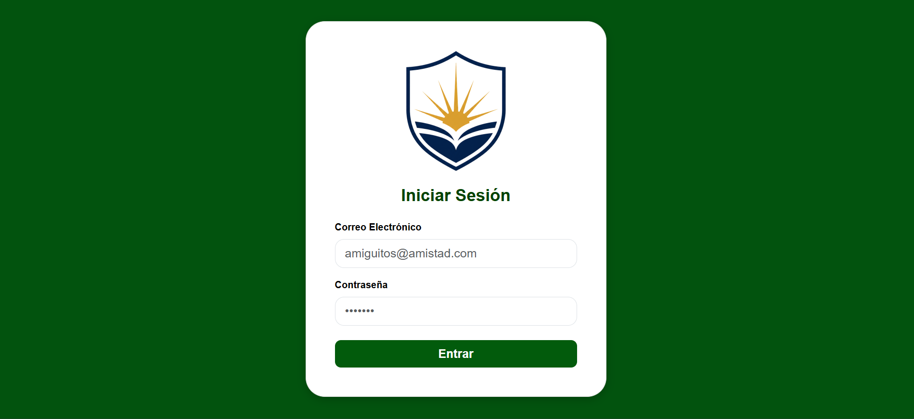
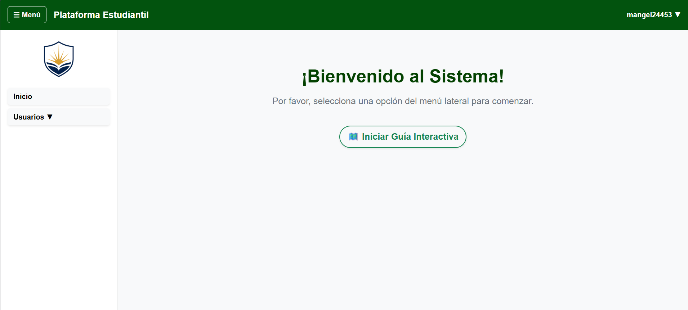
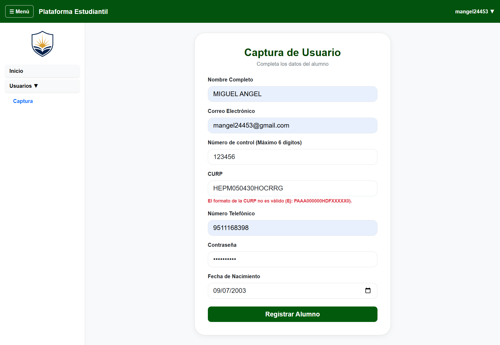
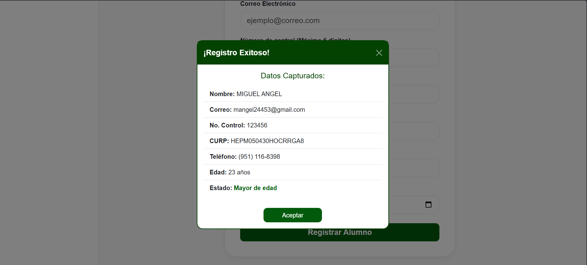
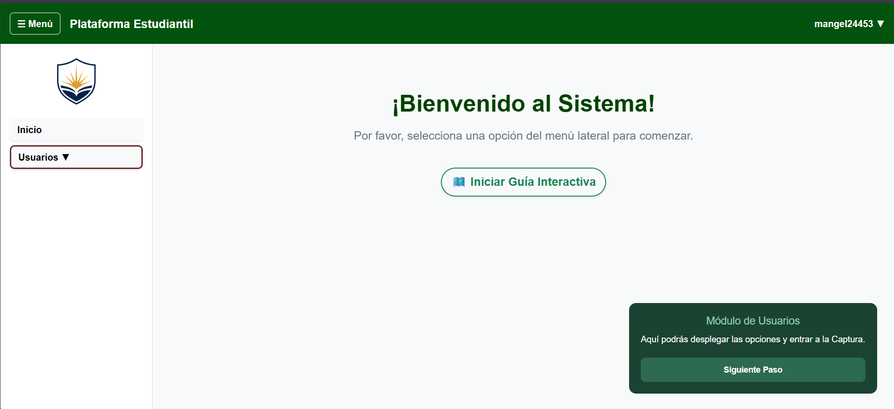
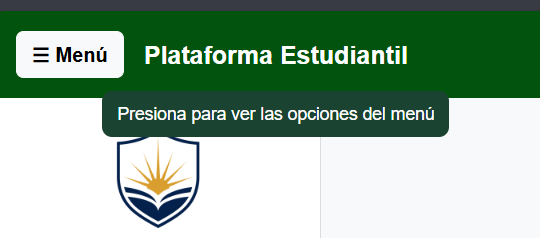

# Proyecto Login - Plataforma Estudiantil

  <strong>INSTITUTO TECNOLÓGICO NACIONAL DE MÉXICO</strong> 
  <strong>INSTITUTO TECNOLÓGICO DE OAXACA</strong>

  <strong>Nombre de la carrera:</strong> 
  Ingeniería en Sistemas Computacionales

  <strong>Nombre de la materia:</strong> 
  Programación Web

  <strong>Unidad:</strong> 
  Unidad 2

  <strong>Título del trabajo:</strong> 
   Actividad 5. Proyecto de Login e Interfaz Dinámica de Captura

  <strong>Alumnos:</strong> 
  Hernández Pérez Miguel Angel 
  Pacheco Aragon Yareli Yazmin

  <strong>Docente:</strong> 
  Adelina Martínez Nieto

  <strong>Grupo:</strong> 
  B

  <strong>Fecha de entrega:</strong> 
  08 de julio del 2026

##  Descripción del Proyecto
Para esta actividad desarrollamos una aplicación web que simula una plataforma escolar real. El sistema está dividido en dos partes principales: una pantalla de inicio de sesión segura  y un panel de control administrativo  que cuenta con un menú lateral navegable y una sección dedicada al registro de alumnos.

## Estructura de Directorios del Repositorio
Para mantener el proyecto bien ordenado y que cada parte haga su trabajo, organizamos nuestros archivos en las siguientes carpetas:

* **`login.html`**: Es la pantalla de entrada donde el usuario pone sus credenciales para iniciar sesión.
* **`index.html`**: Es la página principal del sistema. Aquí cargamos la pantalla de bienvenida, el menú de navegación y el formulario de captura.
* **`css/`**: Carpeta donde guardamos los estilos de diseño.
  * `login.css`: Estilos exclusivos para la pantalla de login (colores, centrado y bordes redondeados).
  * `index.css`: Estilos para el esqueleto del sistema, los textos rojos de error, la animación del menú y los mensajes flotantes.
* **`img/`**: Carpeta para las imágenes del proyecto.
* **`js/`**: Carpeta con toda la lógica de programación en JavaScript, dividida en 5 archivos para que no se revuelva el código:
  * `utileria.js`: Es nuestra biblioteca general. Aquí guardamos las expresiones regulares y funciones para validar correos, contraseñas, formatear teléfonos y calcular la edad.
  * `login.js`: Controla el botón de acceso de la pantalla de login y guarda los datos en la memoria del navegador.
  * `menu.js`: Se encarga de abrir y cerrar el menú lateral, poner el nombre del usuario en la barra superior, cambiar de pantallas y activar la guía del tour.
  * `captura.js`: Revisa en tiempo real que el formulario de captura no tenga errores y controla los datos que se muestran en el modal de éxito.
  * `guiaExplorador.js`: Contiene las funciones para crear los textos de ayuda flotantes que siguen al mouse y la lógica para resaltar los elementos en el tour escolar.

---

##  Explicación y Documentación de los Archivos

### 1. Framework CSS Utilizado
Para el diseño de las pantallas utilizamos Bootstrap 5 (v5.3.3). Decidimos usarlo porque nos ayuda mucho a que la página se adapte a celulares y computadoras gracias a su sistema de rejilla y utilidades de espacio (como `mb-3` o `p-4`). También aprovechamos sus estilos para hacer las cajas de texto más grandes (`form-control-lg`) y para crear el componente del modal de confirmación.

### 2. Estructura de las Vistas (HTML)

####  Archivo `login.html`
Es el formulario de acceso. Tiene dos cajas de texto principales (`#correoElectronico` y `#password`) y un botón para entrar. Abajo de cada campo pusimos etiquetas `div` vacías (`#errorCorreo` y `#errorPassword`) con clases de Bootstrap para texto rojo. Si el usuario escribe algo mal, el JavaScript usa esos `div` para pintar el mensaje de error directamente en la pantalla.

####  Archivo `index.html`
Es el panel completo del sistema. Lo dividimos usando etiquetas de HTML5:
* **`<header>` (Barra Superior)**: Aquí colocamos el botón para ocultar el menú (`#menu-despegable`), el título del sistema y el perfil del usuario activo (`#nomusuario`) junto con el botón de salir.
* **`<aside>` (Menú Lateral)**: Es la barra de navegación que tiene el logo, el botón para regresar a la pantalla de **Inicio** y el botón de **Usuarios** que despliega la opción de "Captura".
* **`<main>` (Zona Central)**: Aquí cargamos dinámicamente dos pantallas mediante JavaScript: la de bienvenida (`#pantallaBienvenida`) que incluye el botón del Tour interactivo, y el formulario de captura (`#seccionFormulario`) que tiene los campos del alumno con sus respectivos letreros de error abajo en rojo.
* **Modal de Confirmación (`#modalRegistro`)**: Está al final del código. Contiene etiquetas `span` vacías (`#modalNombre`, `#modalEdad`, `#modalEstado`, etc.) que se rellenan automáticamente con los datos del alumno cuando todo es correcto, mostrando la ventana flotante de Bootstrap.

##  Proceso de Creación (Paso a Paso)

El desarrollo de nuestro sistema lo fuimos armando de forma ordenada y por etapas de la siguiente manera:

### 🔹 Fase 1: Base de la Interfaz y Estilos Visuales (HTML y CSS)
* **Paso 1 (Estructura del Login) - [Miguel Angel]:** Inició creando el archivo `login.html`, colocando las cajas de texto para el correo y la contraseña, el botón de entrada.
* **Paso 2 (Diseño del Login) - [Miguel Angel]:** Creó el archivo `css/login.css` usando estilos de Bootstrap combinados con estilos propios para centrar la tarjeta de acceso, poner el fondo verde de la escuela, etc. 
* **Paso 3 (Estructura del Sistema) - [Yareli Yazmin]:** Creó la base del archivo `index.html` utilizando etiquetas estructurales fijas (`<header>`, `<aside>`, `<main>`). Aquí dejó maquetadas por separado la sección de la bienvenida y la tarjeta interna del formulario de captura.
* **Paso 4 (Diseño y Animaciones del Sistema) - [Yareli Yazmin]:** Escribió la hoja de estilos `css/index.css`. Configuro el ancho del menú izquierdo en 260px y programó la clase `.oculto`, la cual empuja el menú hacia afuera de la pantalla (`margin-left: -260px`) con un efecto de movimiento suave asistido por transiciones de CSS (`transition: margin-left 0.3s ease`).
### 3. Cómo fluye la información en el sistema

El camino que siguen los datos y el usuario a través de las pantallas funciona de la siguiente manera:

1. **Inicio de sesión (Autenticación):** Cuando pones tus datos en la pantalla de acceso, el script `login.js` los revisa. Si la contraseña y el correo cumplen con las reglas de seguridad de la utilería, el sistema guarda el correo en la memoria del navegador usando `localStorage.setItem('usuarioLogueado', correo)` y te redirige automáticamente a la página `index.html`.

2. **Carga del panel principal y control de acceso:** Al entrar a `index.html`, el archivo `menu.js` revisa de inmediato si hay una sesión guardada en el LocalStorage. Si la memoria está vacía, te expulsa y te regresa al login por seguridad. Si todo está bien, toma el correo guardado, le corta el dominio usando `.split('@')[0]` y pone tu nombre de usuario en la barra superior.

3. **Intercambio dinámico de pantallas:** Al navegar por el menú lateral, el usuario puede dar clic en "Captura". En ese momento, JavaScript oculta la vista de bienvenida cambiando el display a `none` y muestra la tarjeta del formulario de registro cambiando el display a `block`, todo de forma instantánea sin que la página se tenga que recargar.

4. **Llenado y validación del formulario de registro:** Cuando el usuario termina de escribir los datos del nuevo alumno y da clic en "Registrar Alumno", el archivo `captura.js` intercepta el evento y frena el envío automático. El script borra cualquier texto rojo de errores anteriores y empieza a revisar campo por campo apoyándose en `utileria.js`. Si encuentra algo vacío o con un formato incorrecto (como letras en el número de control o una CURP mal estructurada), frena todo con un `return` y pinta la advertencia en rojo justo debajo del input afectado.

5. **Procesamiento de edad y despliegue del modal de éxito:** Si todos los campos pasaron las validaciones con éxito, el script manda la fecha de nacimiento a la función `calcularEdad` para obtener los años en formato numérico. Con este número, el código revisa una condición: si tiene 18 años o más escribe "Mayor de edad", y si tiene menos inyecta "Menor de edad". Después de esto, inyecta todos los datos limpios en los espacios del modal  y levanta la ventana flotante de Bootstrap en la pantalla mostrando el resumen final antes de resetear el formulario.

6. **Cierre de sesión:** Cuando el usuario da clic en la opción "Salir del sistema" dentro del menú de perfil, el script borra por completo los datos guardados usando `localStorage.removeItem('usuarioLogueado')` y te expulsa de regreso a `login.html`, dejando el sistema bloqueado otra vez.

### 4. Funciones creadas en el código JavaScript (`js/`)

#### Funciones dentro de `js/utileria.js`
Es nuestra biblioteca global con funciones que podemos llamar en cualquier parte:
* **`validarCorreo(correo, idError)`**: Revisa mediante una expresión regular que el correo tenga un formato correcto (que lleve arroba, dominio, punto, etc.) y escribe el error abajo si falla.
* **`validarPassword(password, idError)`**: Revisa con un ciclo carácter por carácter que la contraseña cumpla con los requisitos mínimos de seguridad (8 letras, una mayúscula, una minúscula, un número y un símbolo).
* **`soloLetras(texto, idError)`**: Utiliza una expresión regular que solo acepta letras (mayúsculas, minúsculas, acentos y la eñe) para evitar que pongan números en el nombre.
* **`validarLongitud(numero, maxLongitud, idError)`**: Comprueba que un valor tenga puros números enteros y que no se pase del límite máximo de caracteres configurado.
* **`formatearTelefono(telefono)`**: Limpia el texto eliminando espacios o guiones extraños, valida que sean exactamente 10 números y le da un formato visual ordenado: `(951) 123-4567`.
* **`calcularEdad(fechaNacimiento, elError)`**: Resta el año actual con tu año de nacimiento usando objetos `Date()` para saber tu edad exacta en números enteros, y revisa que nadie ponga fechas vacías o del futuro.
* **`validarCURP(curp)`**: Usa una expresión regular estricta para comprobar que la CURP tenga el formato oficial mexicano de 18 caracteres en mayúsculas.

####  Lógica de los demás scripts
* **`js/login.js`**: Captura el clic del botón de entrar, manda a llamar a las validaciones de correo y contraseña pasándole los contenedores de error del HTML y, si pasan a true, guarda la sesión y te redirige al index.
* **`js/menu.js`**: Controla el funcionamiento visual del panel de control. Activa el botón para encoger el menú lateral usando `.classList.toggle('oculto')` y maneja los intercambios de pantalla cambiando el display (`none` / `block`) al dar clic en Inicio o Captura.
* **`js/captura.js`**: Controla el formulario de alumnos. Lee los datos de los inputs, borra errores viejos y va validando campo por campo apoyándose en la utilería. Al final evalúa la edad calculada: si es mayor o igual a 18 escribe "Mayor de edad" , y si es menor escribe "Menor de edad" , rellenando los datos del modal antes de abrirlo.
* **`js/guiaExplorador.js`**: Controla la ayuda interactiva. La función `agregarAyuda` inyecta un letrero flotante al body que sigue dinámicamente al puntero del mouse. La función `crearTour` recorre una lista de pasos y le pone un borde destacado (`.tour-resaltado`) al botón o menú que se está explicando.

## Proceso de Creación (Paso a Paso)

### Fase 1: Creación del Login
* **Paso 1 - [Miguel Angel]:** Empecé armando la pantalla de acceso (`login.html`), poniendo lo básico en HTML para pedir el correo y la contraseña. Fui añadiendo simplemente los respectivos inputs para los campos de correo y contraseña, así como un botón para simular el envío del formulario.
* **Paso 2 - [Miguel Angel]:** Después, le agregué diseño usando Bootstrap 5 y un archivo CSS propio (`login.css`) para centrar el formulario, ponerle colores, redondear los bordes y darle una mejor presentación al botón de entrada.
* **Paso 3 - [Miguel Angel]:** Así mismo busqué una imagen adecuada que representara la institución y la coloqué en la parte superior.

El desarrollo del proyecto lo fuimos armando de forma ordenada y por etapas.

### 🔹 Fase 2: Maquetación y Diseño del Panel Principal (HTML y CSS)
* **Paso 1 (Esqueleto del Sistema) - [Yareli Yazmin]:** Creé la base de nuestro archivo principal `index.html` utilizando etiquetas estructurales fijas de HTML5 (`<header>`, `<aside>` y `<main>`). En esta estructura dejé separados y listos los dos bloques grandes de la zona de trabajo: la tarjeta con el mensaje de bienvenida y la sección oculta del formulario de captura del alumno.
* **Paso 2 (Animaciones y Estilos del Panel) - [Yareli Yazmin]:** Escribí la hoja de estilos `css/index.css`. Aquí configuré el menú lateral izquierdo  y programó la clase `.oculto`.  De esta forma, el menú se desliza suavemente hacia un lado al ocultarse en lugar de desaparecer de golpe.

### 🔹 Fase 3: Lógica de la Plataforma, Seguridad y Vistas (JavaScript)
* **Paso 3 (Desarrollo de la Biblioteca Global) - [Yareli Yazmin / Equipo]:** Con las interfaces listas, trabajamos en conjunto en el archivo `js/utileria.js`. Aquí programamos las funciones lógicas principales, las expresiones regulares y los ciclos para validar los formatos de correo, contraseñas, longitud de caracteres y CURP.
* **Paso 4 (Integración del Clúster y Código Reutilizable) - [Miguel Angel]:** Me encargué de armar el clúster de archivos e insertar el código reutilizable de la `guiaExplorador.js` y las utilerías. Aunque estos archivos ya tenían muchas líneas de comentarios y código propios de su autor original (lo que a simple vista hace parecer que escribí más líneas desde cero), mi verdadero trabajo fue insertarlos, conectarlos y adaptarlos para que funcionaran sin conflictos en nuestro proyecto. Además, me encargué de toda la lógica del archivo `login.js` para validar el acceso y controlar la sesión.

### 🔹 Fase 4: Formulario Inteligente, Modal de Resumen y Tour Asistido
* **Paso 5 (Validaciones sin Alerts) - [Yareli Yazmin / Equipo]:** Desarrollamos el script `js/captura.js` para controlar el formulario de alumnos. Lo configuramos de modo que, al presionar registrar, limpie los errores viejos y revise los campos uno por uno. Si detecta datos vacíos o formatos incorrectos en el teléfono o la CURP, frena todo con un `return` y pinta los textos de advertencia en color rojo directamente abajo de la caja de texto afectada.
* **Paso 6 (Integración e Inyección en el Modal) - [Yareli Yazmin]:** Agregué el componente del modal de Bootstrap (`#modalRegistro`) al fondo de mi `index.html`. Después, en `js/captura.js`, programé la lógica que recibe los años de la función `calcularEdad` y evalúa una condición: si el alumno tiene 18 años o más, escribe "Mayor de edad",  y si es menor, inyecta "Menor de edad" . Al pasar las validaciones, el script inyecta todos los datos en los `` del modal y levanta la ventana flotante de confirmación antes de resetear el formulario.
* **Paso 7 (Lógica de la Ventana Modal) - [Miguel Angel]:** Apoyé armando el clúster de los datos y estructurando la lógica de la ventana modal, asegurándome de que toda la información capturada y validada fluyera de forma correcta hacia el componente flotante para mostrarse al usuario.

## Capturas del Flujo Completo Funcionando

### 1. Pantalla de Acceso (Login)

### 2. Panel de Inicio del Sistema (Bienvenida)

### 3. Interfaz del Formulario con Errores de Validación

### 4. Modal de Confirmación de Datos del Alumno (Éxito)

### 5. Guía Interactiva del Explorador

### 6. Sistema de Ayuda y Tooltips

